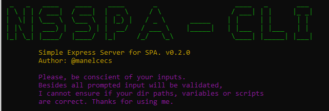
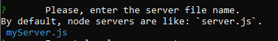
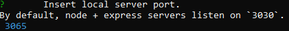
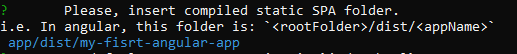
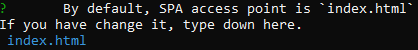
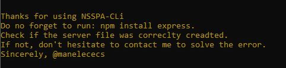

# node-server-spa

NPM node based CLI package to provide a fast, complete and reliable way to publish, deploy or test SPA (Angular projects) via Node + Express server.

## What NSSPA do?

NSSPA creates an express server file to serve SPA in development and production enviroments. Simple.

# Install

## Requirements

 - A pc with any O.S. capable of run node.
 - Internet access. You don't need 1Gb, but it's cool.
 - Node.js 12+ minimun.

Easy as pie, run: `npm install @manelcecs/node-server-spa`
ps: yes, a bit long... sorry.

# Usage
 Did i say this is fast and easy? No? O.K.
 
 This package is fast and easy to use. Just run on your root folder: `nsspa`
 
 TIP: NodeServerSinglePageApplication, just to keep it in mind.
 
 
## Step 1

The CLI will ask the name of your server file. Just press enter to let default `server.js` or type the name you want.

Try not to set directory or weird strings, it will crash or worse, it's going to append `.js` at the end.

## Step 2

Time to configure your server.

 1. PORT: the local port where the server will listen.

    
 2. Distribution folder: the compiled static folder where your application will be serverd.

    
 3. Access Point: this is the html file where all javascript static files are indexed, by default is `index.html` but if you've changed it, let the cli know.
 
    

# The End

That's all. Now you can run `npm run nsspa-deploy`.

### Comming soon

The next steps, is test. Test it a lot.

But then:

 - Package.json script to set the servers as main
 - Optimiced servers for each framework
 - ...
